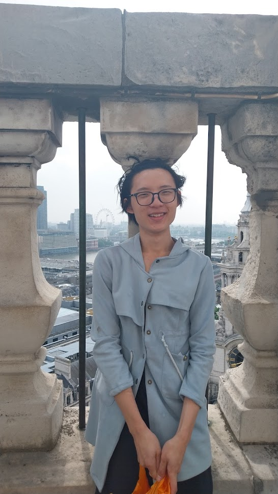
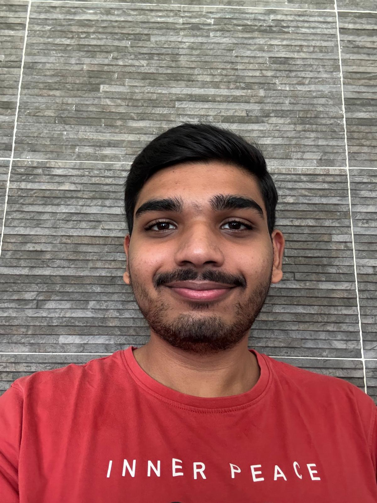
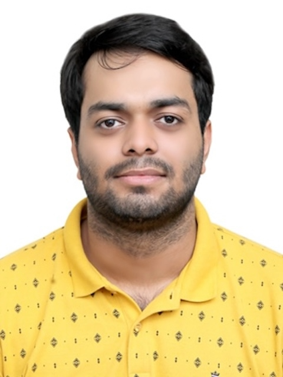

We are a team based in the [School of Computing, National University of Singapore](https://www.comp.nus.edu.sg).

You can reach us at the email `seer[at]comp.nus.edu.sg`

## Project team

### Benedict

[[github](https://github.com/bentandj)]
[[portfolio](team/bentandj.md)]

* Role: Developer

### Leheng

[[github](http://github.com/c-j-lh)]
[[portfolio](team/c-j-lh.md)]

* Likes yoga

### Shah Mihir Sunil

[[github](http://github.com/mihirshah2005)] [[portfolio](team/mihirshah2005.md)]

* Role: Developer
* Responsibilities: Data

### Jean Doe

[[github](http://github.com/johndoe)]
[[portfolio](team/johndoe.md)]

* Role: Developer
* Responsibilities: Dev Ops + Threading

### Ranen Chow

[[github](http://github.com/recursive-rc)]
[[portfolio](team/ranenchow.md)]

* Role: Developer
* Responsibilities: UI

_{Update roles and responsibilities later}_

### Labdh Sharma

[[github](http://github.com/LABDHH)]
[[portfolio](team/labdh.md)]

* Role: Developer
* Responsibilities: UI
