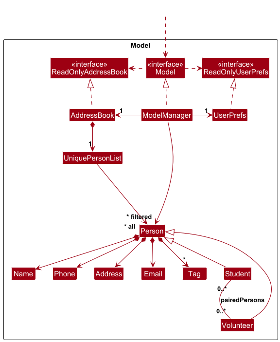
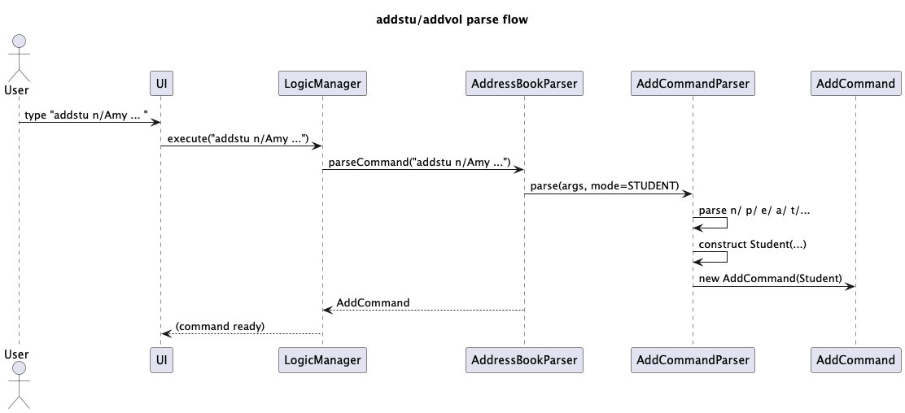
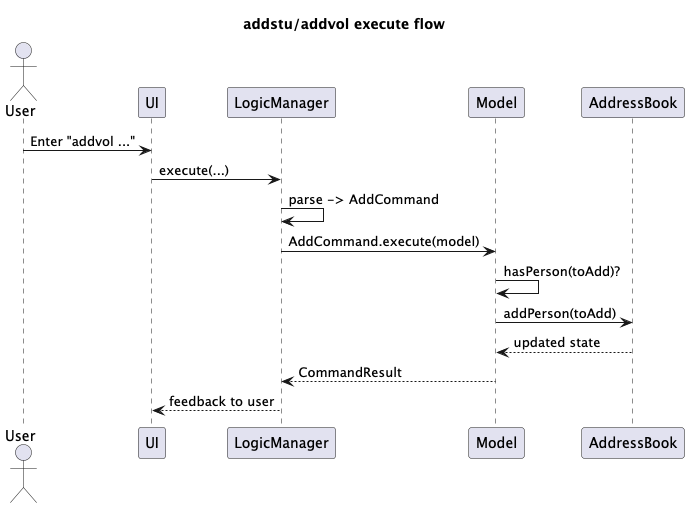
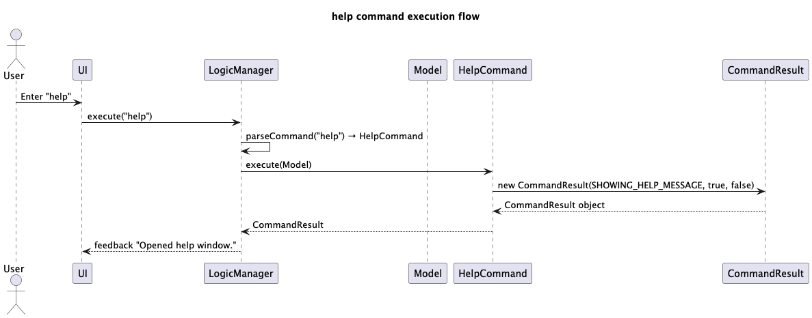

* Table of Contents
{:toc}

--------------------------------------------------------------------------------------------------------------------

## **Acknowledgements**

* Images of some developers taken from [Portrait placeholder.png](https://en.wikipedia.org/wiki/File:Portrait_placeholder.png), created by [Andomedium](https://en.wikipedia.org/wiki/User:Andomedium) and edited by [Jajobi](https://en.wikipedia.org/wiki/User:Jajobi), retrieved from [Wikipedia](https://en.wikipedia.org/), used under [CC0 1.0 Universal](https://creativecommons.org/publicdomain/zero/1.0/).
* Used [JetBrains Full Line Code Completion plug-in](https://plugins.jetbrains.com/plugin/14823-full-line-code-completion).
* Code for sorting list (such as adding `SortedList<…>` field to `ModelManager` and related methods in `Model`, `Logic`, and related classes) inspired by changes made in this [Pull Request for a sorting command](https://github.com/AY2526S1-CS2103T-T15-2/tp/pull/140/files) by GitHub user [AndrescuIII-too](https://github.com/AndrescuIII-too).
* While enhancing the help feature, ChatGPT was primarily used to clarify concepts related to implementing basic HTML and CSS for the help command, as well as to refine several test cases following updates to the help and storage components.

--------------------------------------------------------------------------------------------------------------------

## **Setting up, getting started**

Refer to the guide [_Setting up and getting started_](SettingUp.md).

--------------------------------------------------------------------------------------------------------------------

## **Design**

:bulb: **Tip:** The `.puml` files used to create diagrams are in this document `docs/diagrams` folder. Refer to the [_PlantUML Tutorial_ at se-edu/guides](https://se-education.org/guides/tutorials/plantUml.html) to learn how to create and edit diagrams.

### Architecture

The ***Architecture Diagram*** given above explains the high-level design of the App.

Given below is a quick overview of main components and how they interact with each other.

**Main components of the architecture**

**`Main`** (consisting of classes [`Main`](https://github.com/AY2526S1-CS2103T-F10-1/tp/tree/master/src/main/java/seedu/address/Main.java) and [`MainApp`](https://github.com/AY2526S1-CS2103T-F10-1/tp/tree/master/src/main/java/seedu/address/MainApp.java)) is in charge of the app launch and shut down.
* At app launch, it initializes the other components in the correct sequence, and connects them up with each other.
* At shut down, it shuts down the other components and invokes cleanup methods where necessary.

The bulk of the app's work is done by the following four components:

* [**`UI`**](#ui-component): The UI of the App.
* [**`Logic`**](#logic-component): The command executor.
* [**`Model`**](#model-component): Holds the data of the App in memory.
* [**`Storage`**](#storage-component): Reads data from, and writes data to, the hard disk.

[**`Commons`**](#common-classes) represents a collection of classes used by multiple other components.

**How the architecture components interact with each other**

The *Sequence Diagram* below shows how the components interact with each other for the scenario where the user issues the command `delete 1`.

Each of the four main components (also shown in the diagram above),

* defines its *API* in an `interface` with the same name as the Component.
* implements its functionality using a concrete `{Component Name}Manager` class (which follows the corresponding API `interface` mentioned in the previous point.

For example, the `Logic` component defines its API in the `Logic.java` interface and implements its functionality using the `LogicManager.java` class which follows the `Logic` interface. Other components interact with a given component through its interface rather than the concrete class (reason: to prevent outside component's being coupled to the implementation of a component), as illustrated in the (partial) class diagram below.

The sections below give more details of each component.

### UI component

The **API** of this component is specified in [`Ui.java`](https://github.com/AY2526S1-CS2103T-F10-1/tp/tree/master/src/main/java/seedu/address/ui/Ui.java)

The UI consists of a `MainWindow` that is made up of parts e.g.`CommandBox`, `ResultDisplay`, `PersonListPanel`, `StatusBarFooter` etc. All these, including the `MainWindow`, inherit from the abstract `UiPart` class which captures the commonalities between classes that represent parts of the visible GUI.

The `UI` component uses the JavaFx UI framework. The layout of these UI parts are defined in matching `.fxml` files that are in the `src/main/resources/view` folder. For example, the layout of the [`MainWindow`](https://github.com/AY2526S1-CS2103T-F10-1/tp/tree/master/src/main/java/seedu/address/ui/MainWindow.java) is specified in [`MainWindow.fxml`](https://github.com/AY2526S1-CS2103T-F10-1/tp/tree/master/src/main/resources/view/MainWindow.fxml)

The `UI` component,

* executes user commands using the `Logic` component.
* listens for changes to `Model` data so that the UI can be updated with the modified data.
* keeps a reference to the `Logic` component, because the `UI` relies on the `Logic` to execute commands.
* depends on some classes in the `Model` component, as it displays `Person` object residing in the `Model`.

### Logic component

**API** : [`Logic.java`](https://github.com/AY2526S1-CS2103T-F10-1/tp/tree/master/src/main/java/seedu/address/logic/Logic.java)

Here's a (partial) class diagram of the `Logic` component:

The sequence diagram below illustrates the interactions within the `Logic` component, taking `execute("delete 1")` API call as an example.

:information_source: **Note:** The lifeline for `DeleteCommandParser` should end at the destroy marker (X) but due to a limitation of PlantUML, the lifeline continues till the end of diagram.

How the `Logic` component works:

1. When `Logic` is called upon to execute a command, it is passed to an `AddressBookParser` object which in turn creates a parser that matches the command (e.g., `DeleteCommandParser`) and uses it to parse the command.
1. This results in a `Command` object (more precisely, an object of one of its subclasses e.g., `DeleteCommand`) which is executed by the `LogicManager`.
1. The command can communicate with the `Model` when it is executed (e.g. to delete a person). 
   Note that although this is shown as a single step in the diagram above (for simplicity), in the code it can take several interactions (between the command object and the `Model`) to achieve.
1. The result of the command execution is encapsulated as a `CommandResult` object which is returned back from `Logic`.

Here are the other classes in `Logic` (omitted from the class diagram above) that are used for parsing a user command:

How the parsing works:
* When called upon to parse a user command, the `AddressBookParser` class creates an `XYZCommandParser` (`XYZ` is a placeholder for the specific command name e.g., `AddCommandParser`) which uses the other classes shown above to parse the user command and create a `XYZCommand` object (e.g., `AddCommand`) which the `AddressBookParser` returns back as a `Command` object.
* All `XYZCommandParser` classes (e.g., `AddCommandParser`, `DeleteCommandParser`, ...) inherit from the `Parser` interface so that they can be treated similarly where possible e.g, during testing.

### Model component
**API** : [`Model.java`](https://github.com/AY2526S1-CS2103T-F10-1/tp/tree/master/src/main/java/seedu/address/model/Model.java)

The `Model` component,

* stores the address book data i.e., all `Person` objects (which are contained in a `UniquePersonList` object).
* stores the currently 'selected' `Person` objects (e.g., results of a search query) as a separate _filtered_ list which is exposed to outsiders as an unmodifiable `ObservableList<Person>` that can be 'observed' e.g. the UI can be bound to this list so that the UI automatically updates when the data in the list change.
* stores a `UserPref` object that represents the user’s preferences. This is exposed to the outside as a `ReadOnlyUserPref` objects.
* does not depend on any of the other three components (as the `Model` represents data entities of the domain, they should make sense on their own without depending on other components)

:information_source: **Note:** An alternative (arguably, a more OOP) model is given below. It has a `Tag` list in the `AddressBook`, which `Person` references. This allows `AddressBook` to only require one `Tag` object per unique tag, instead of each `Person` needing their own `Tag` objects. 

### Storage component

**API** : [`Storage.java`](https://github.com/AY2526S1-CS2103T-F10-1/tp/tree/master/src/main/java/seedu/address/storage/Storage.java)

The `Storage` component,
* can save both address book data and user preference data in JSON format, and read them back into corresponding objects.
* inherits from both `AddressBookStorage` and `UserPrefStorage`, which means it can be treated as either one (if only the functionality of only one is needed).
* depends on some classes in the `Model` component (because the `Storage` component's job is to save/retrieve objects that belong to the `Model`)

### Common classes

Classes used by multiple components are in the `seedu.address.commons` package.

--------------------------------------------------------------------------------------------------------------------

## **Implementation**

This section describes some noteworthy details on how certain features are implemented.

### Adding Students and Volunteers: `addstu` / `addvol`

#### Overview
We split the original `add` command into two explicit commands:
- `addstu` — creates a **Student**
- `addvol` — creates a **Volunteer**

Both accept the same fields (`[n/] [p/] [e/] [a/] [t/TAG]…`) and share the same validation and duplicate checks. They differ only in the concrete subtype instantiated.

Changes at a glance:
- Introduced `Student` and `Volunteer` subtypes (extend `Person`).
- Introduced `EntryType { STUDENT, VOLUNTEER }` held by `Person`.
- `Person` now contains:
    - `EntryType type`
    - `List<Person> pairings` (symmetric links, rendered in the UI, serialized as identity refs)
- Storage persists `type` and `pairings` via `JsonAdaptedPerson`.

#### Parsing flow
`AddressBookParser` routes by command word:
- `addstu` → `AddCommandParser` (student mode) → `new Student(...)`
- `addvol` → `AddCommandParser` (volunteer mode) → `new Volunteer(...)`

#### Execution flow
- `LogicManager#execute` runs AddCommand which:
- `Model#hasPerson(toAdd)` duplicate check
- `Model#addPerson(toAdd)` mutates `AddressBook`
- UI auto-updates from observable lists

### Help Command

The sequence diagram below shows how the `help` command is executed.

--------------------------------------------------------------------------------------------------------------------

## **Documentation, logging, testing, configuration, dev-ops**

* [Documentation guide](Documentation.md)
* [Testing guide](Testing.md)
* [Logging guide](Logging.md)
* [Configuration guide](Configuration.md)
* [DevOps guide](DevOps.md)

--------------------------------------------------------------------------------------------------------------------

## **Appendix: Requirements**

### Product scope

**Target user profile**:

* volunteer agency coordinators running a social service organisation managing volunteers who provide free tuition to underprivileged teenagers
* has a need to manage a significant number of contacts
* prefer desktop apps over other types
* can type fast
* hate using the mouse
* very efficient in using the CLI

**Value proposition**: CLI-based contact book to manage volunteer tutors. Tag people by skills, area, and availability. Easily find volunteers living nearby new tutees with appropriate skills and availability. Help easily track attendance to generate reports on volunteer hours.

### User stories

Priorities: High (must have) - `* * *`, Medium (nice to have) - `* *`, Low (unlikely to have) - `*`

| Priority | As a …​         | I want to …​                                                         | So that I can…​                                                                                              |
|----------|-----------------|----------------------------------------------------------------------|--------------------------------------------------------------------------------------------------------------|
| `* * *`  | new user        | see usage instructions                                               | refer to instructions when I forget how to use the App                                                       |
| `* * *`  | user            | add a new person                                                     |                                                                                                              |
| `* * *`  | user            | find a person by name                                                | locate details of persons without having to go through the entire list                                       |
| `* * *`  | tuition manager | easily retrieve contact information about a volunteer or student           | quickly contact them for urgent matters or emergencies                                                       |
| `* * *`  | volunteer manager   | add subjects that a volunteer is good at or that a student needs help with | easily pair up a student with a well-equipped volunteer                                                            |
| `* * *`  | volunteer manager   | add volunteer-student pairings                                             | to keep track of volunteer-student pairings                                                                        |
| `* * *`  | volunteer manager   | remove volunteer-student pairings                                          | to keep track of volunteer-student pairings when there are changes                                                 |
| `* * *`  | tuition manager | remove or archive information about selected tutors or tutees        | view a less cluttered contact list without tutees who have graduated or tutors who have stopped volunteering |
| `* *`    | careless user   | be reminded of duplicate names                                       | ensure not to accidentally add the same person twice                                                         |
| `* *`    | volunteer manager   | filter tutors by both subject expertise                              | assign the most suitable volunteer without manual cross-checking                                                 |
| `* *`    | volunteer manager   | keep track of subjects a student needs help in                         | prepare relevant study materials and find appropriate tutors to pair with                                    |

### Use cases

(For all use cases below, the **System** is the `VolunteeRoll` and the **Actor** is the user who manages the voluntary tuition programme, unless specified otherwise)

**Use case: Delete a person**

**MSS**

1.  User requests to list persons
2.  VolunteeRoll shows a list of persons
3.  User requests to delete a specific person in the list
4.  VolunteeRoll deletes the person

    Use case ends.

**Extensions**

* 2a. The list is empty.

  Use case ends.

* 3a. The given index is invalid.

    * 3a1. VolunteeRoll shows an error message.

      Use case resumes at step 2.

**Use case: Retrieve contact and next-of-kin information**

**MSS**

1.	A tuition manager searches for a volunteer or student in the contact list
2. The tuition manager selects their profile
3. The tuition manager opens the details page to view their phone number and next-of-kin information for urgent communication

Use case ends.

**Use case: Add subjects to a volunteer or student profile**

**MSS**

1.	A volunteer manager searches for the person’s profile
2. The volunteer manager selects “Edit Subjects”
3. The volunteer manager chooses the relevant subject tags or creates new ones
4. The volunteer manager saves the changes so the system updates pairing suggestions

Use case ends.

**Use case: Share contact details with colleagues**

**MSS**

1.	An organisation member filters the contacts to find the relevant tutors or tutees
2. The organisation member selects tutors and tutees
3. The organisation member clicks "Share Contact Info"
4. The organisation member enters the colleage's details
5. The organisation member sends the selected information securely

Use case ends.

**Use case: Archive inactive tutors or tutees**

**MSS**

1. A tuition manager searches for a volunteer or student who has graduated or left
2. The tuition manager selects the profile
3. The tuition manager chooses the "Archive/Remove" option
4. The tuition manager confirms the action to move them out of the active list

Use case ends.

**Use case: Filter tutors by subject and availability**

**MSS**

1.	A volunteer manager opens the contact list
2. The volunteer applies filters for subject expertise and time availability
3. The volunteer reviews the filtered results
4. The volunteer selects the best-matched volunteer for a new student

Use case ends.

### Non-Functional Requirements

1.  Should work on any _mainstream OS_ as long as it has Java `17` or above installed.
2.  Should be able to hold up to 1000 persons without a noticeable sluggishness in performance for typical usage.
3.  A user with above average typing speed for regular English text (i.e. not code, not system admin commands) should be able to accomplish most of the tasks faster using commands than using the mouse.
4. The system should work on 64-bit environments.
5. The system should respond within two seconds.
6. The system should be usable by a novice who has never used an address book before.
7. The project is expected to adhere to a schedule that delivers a feature set weekly.
8. The product is not required to be used by multiple people simultaneously.
9. The product is not required to be usable online.

### Glossary

* **Mainstream OS**: Windows, Linux, Unix, MacOS
* **Tuition**: Providing academic support to students, such as helping them with homework questions and giving them additional practice on topics covered.
* **Person**: An entry in the address book.
* **Volunteer**: A person who is tutoring students on a voluntary basis. People who are volunteering but are not engaged in tutoring students (such as volunteering in unrelated areas like beach cleanups or animal welfare) are not considered volunteers for the purposes of VolunteeRoll.
* **Student**: A student who is being tutored as part of the voluntary tuition programme. Note that even if volunteers may be considered a student in a different context (for example, a volunteer who is also a student as a university) is **not** consider a "student" for the purposes of VolunteeRoll.
* **Tuition/volunteer manager**: The person working at the volunteer welfare organisation that manages the tuition programme, in particular, working with the volunteers and students.

--------------------------------------------------------------------------------------------------------------------

## **Appendix: Instructions for manual testing**

Given below are instructions to test the app manually.

:information_source: **Note:** These instructions only provide a starting point for testers to work on;
testers are expected to do more *exploratory* testing.

### Launch and shutdown

1. Initial launch

   1. Download the jar file and copy into an empty folder

   1. Double-click the jar file Expected: Shows the GUI with a set of sample contacts. The window size may not be optimum.

1. Saving window preferences

   1. Resize the window to an optimum size. Move the window to a different location. Close the window.

   1. Re-launch the app by double-clicking the jar file. 
       Expected: The most recent window size and location is retained.

### Deleting a person

1. Deleting a person while all persons are being shown

   1. Prerequisites: List all persons using the `list` command. Multiple persons in the list.

   1. Test case: `delete 1` 
      Expected: First contact is deleted from the list. Details of the deleted contact shown in the status message. Timestamp in the status bar is updated.

   1. Test case: `delete 0` 
      Expected: No person is deleted. Error details shown in the status message. Status bar remains the same.

   1. Other incorrect delete commands to try: `delete`, `delete x`, `...` (where x is larger than the list size) 
      Expected: Similar to previous.

### Saving data

1. Dealing with missing data files

   1. To simulate a missing file, delete data/addressbook.json.
   2. Start the app. Expected: Shows the GUI with 3 default students and 3 default volunteers.
   3. Enter the clear command. Expected: GUI shows 0 students and 0 volunteers.
   4. Enter the addstu command. Expected: GUI shows 1 student.

2. Dealing with corrupted data files

   1. Prerequisites: Have multiple persons in data/addressbook.json, and the syntax is valid.
   2. To simulate a corrupted data file, make the phone number of the first student two digits long so that it is invalid.
   3. Start the app. Expected: All the other persons are shown except the invalid person.
   4. Add a student. Expected: Student is added to the list.
   5. Close the app. Expected: The invalid person entry has been removed from the json file.

### Target User
Volunteer agency coordinators running a social service organisation managing volunteers who provide free tuition to underprivileged teenagers. Target users are very efficient in using the CLI and hate using the mouse.

### Value Proposition
CLI-based contact book to manage volunteer tutors. Tag people by skills, area, and availability. Easily find volunteers living nearby new tutees with appropriate skills and availability. Help easily track attendance to generate reports on volunteer hours.
