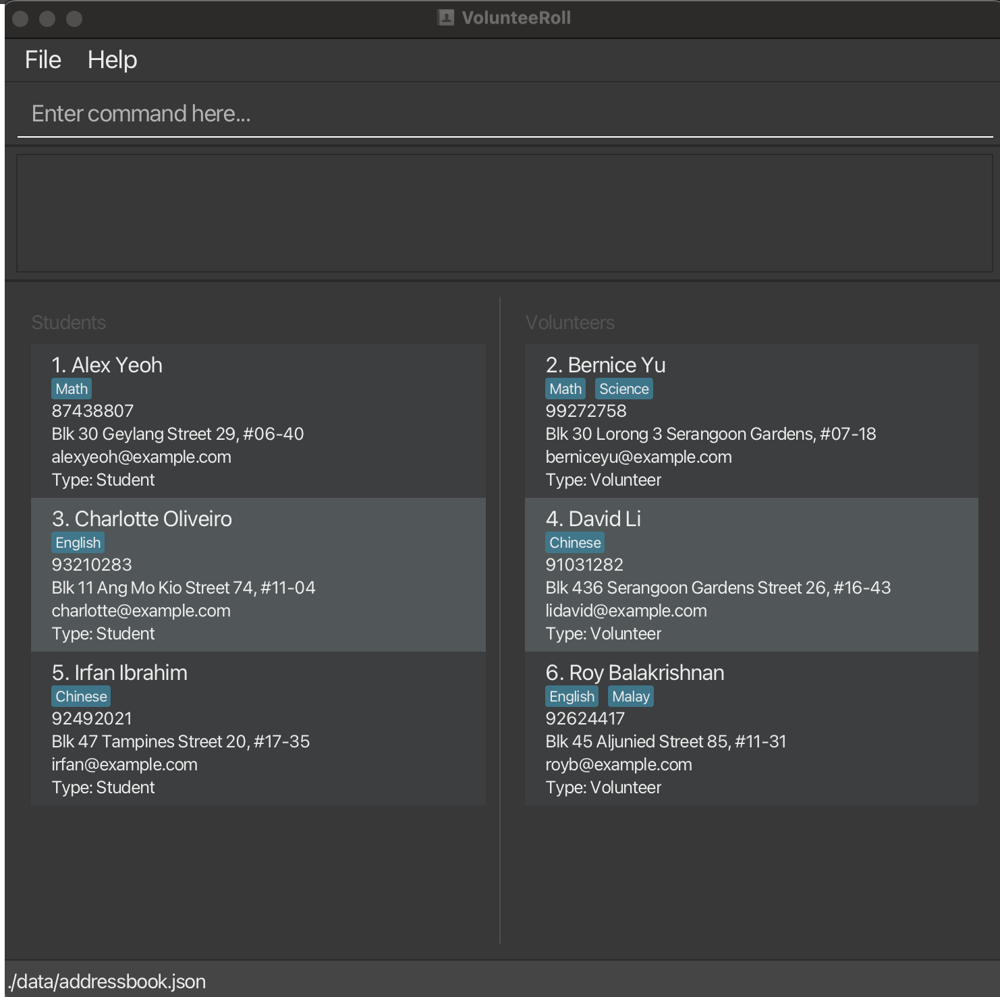
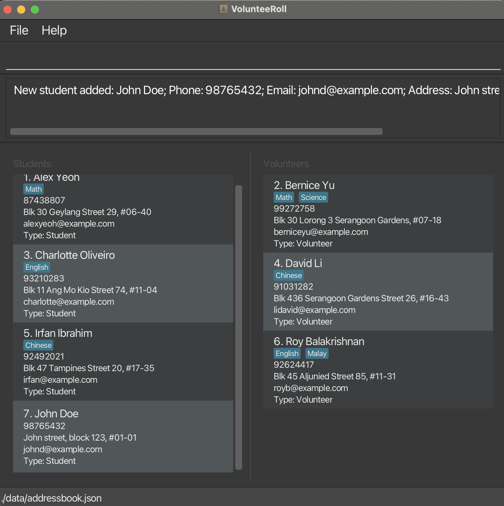
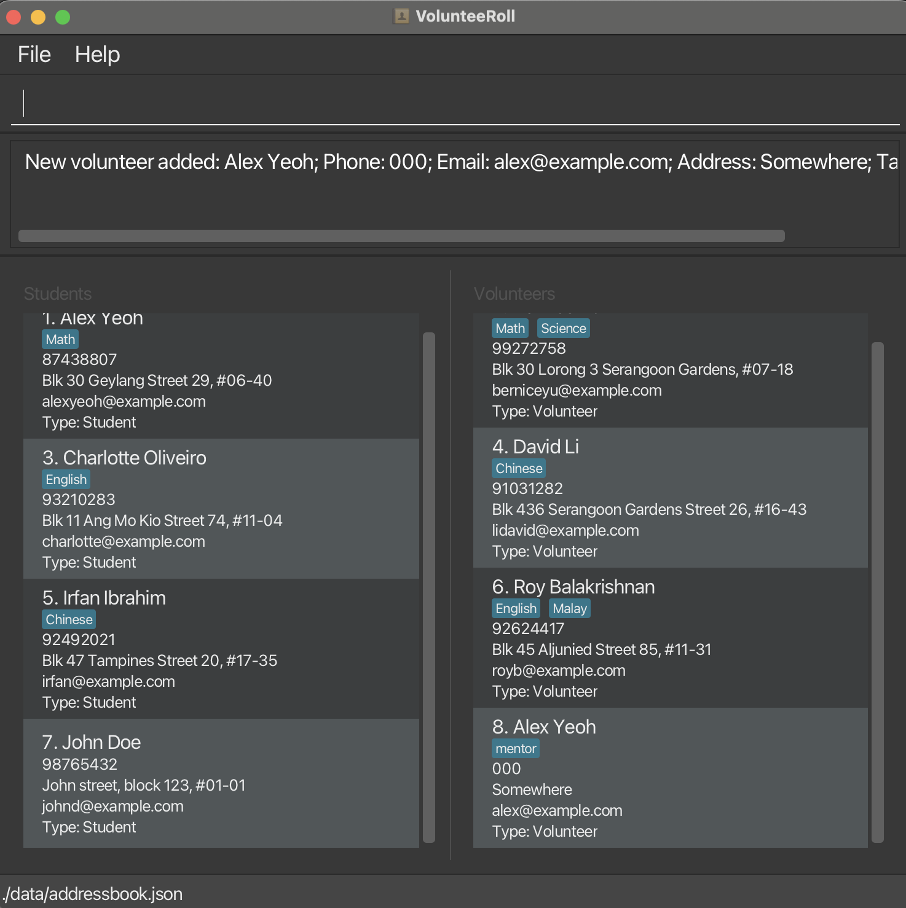
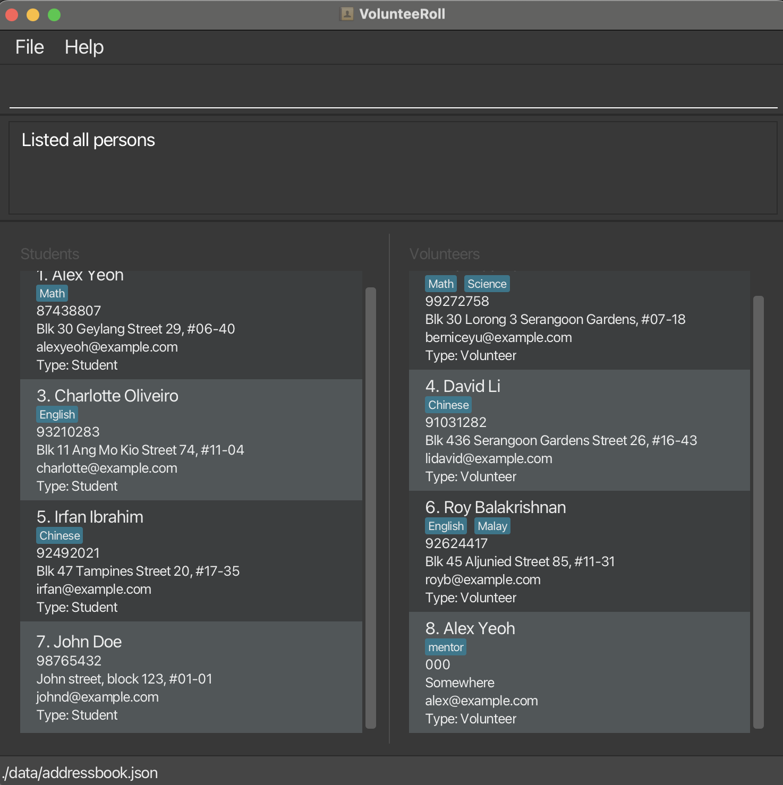
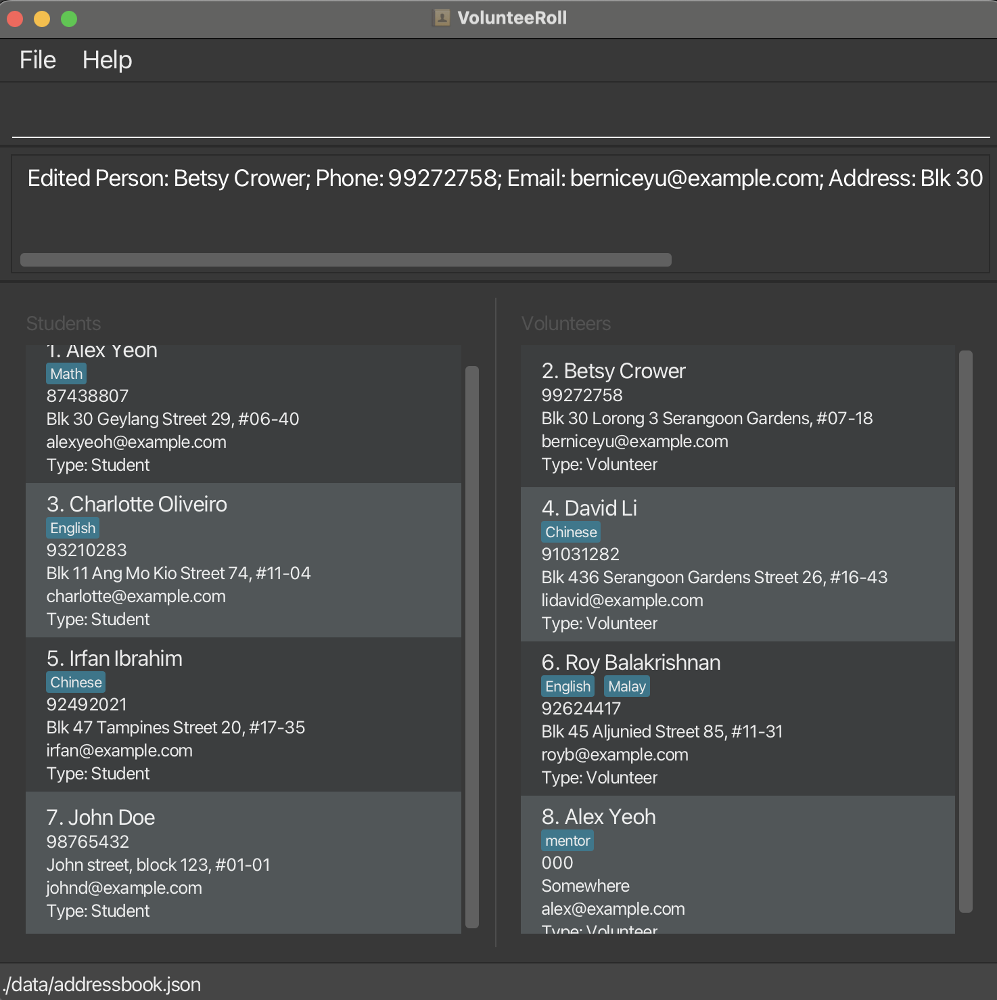
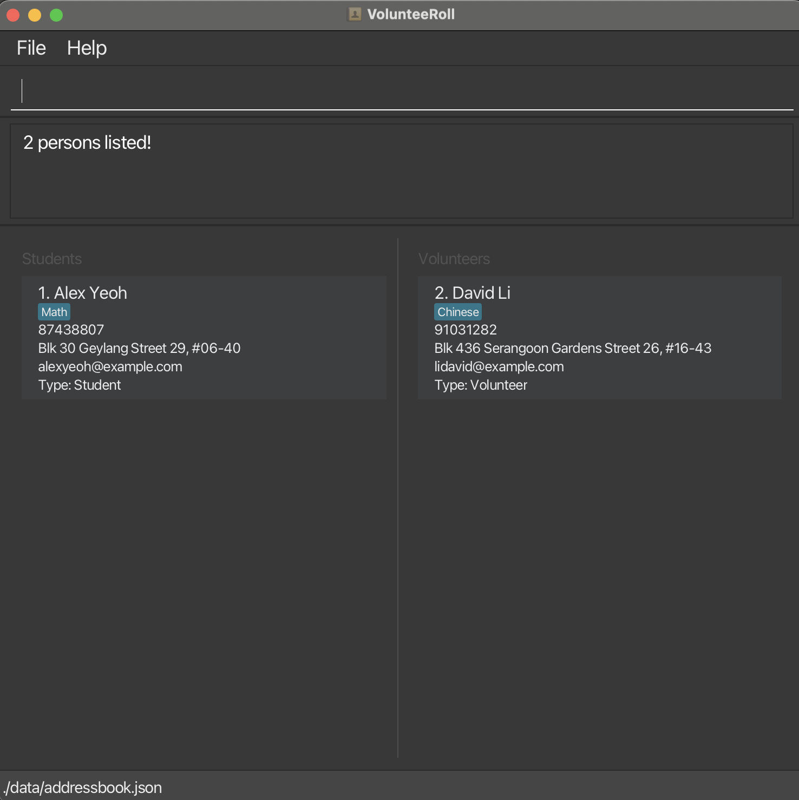
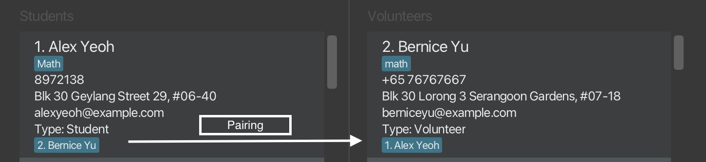
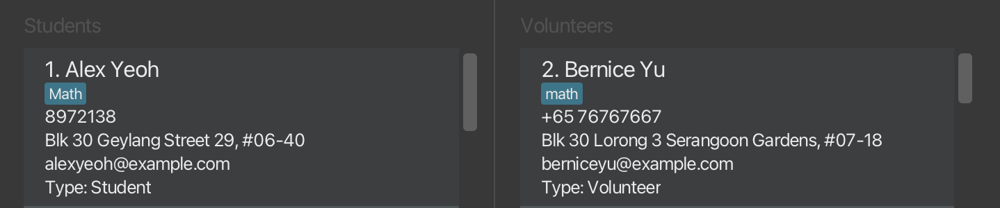

Many voluntary welfare organisation in Singapore run tuition programmes for underprivileged students who are unable to afford private tuition classes. 

VolunteeRoll is a desktop application designed to help the coordinators of such voluntary tuition programmes efficiently manage student and volunteer information.

It combines the speed of a **Command Line Interface (CLI) with the clarity of a modern Graphical User Interface (GUI)**, making it ideal for users who prefer typing commands to navigate and manage data quickly.

### VolunteeRoll allows users to:
{: .no_toc}

1. Store and organize student and volunteer contact information
2. Match students with suitable volunteers based on shared tags or subjects
3. Maintain a synchronized view of all pairings and unpairings
4. Edit and update data instantly, with automatic saving

### Why use VolunteeRoll?
{: .no_toc}

If you’re managing tutoring programs, community service groups, or any volunteer-based initiative, VolunteeRoll helps you stay organized - without needing spreadsheets or complex databases.

### Who is this guide for?
{: .no_toc}

This guide is intended for:
1. Volunteer coordinators or program leads who manage student–volunteer matching.
2. Users who have basic familiarity with computers and can follow simple command-line instructions.
3. Those who prefer fast, text-based interactions over traditional GUI-heavy tools.

### Table of Contents : 
{: .no_toc}

* Table of Contents
{:toc}

--------------------------------------------------------------------------------------------------------------------

## Quick start

Follow these steps to get VolunteeRoll running in minutes.
1. **Ensure you have Java `17` or above installed in your computer.** 
    * **Mac users:** Ensure you have the precise JDK version prescribed [here](https://se-education.org/guides/tutorials/javaInstallationMac.html).

2. **Download the latest release**
    * Download the latest `.jar` file from [VolunteeRoll releases page](https://github.com/AY2526S1-CS2103T-F10-1/tp/releases).

3. **Set up your workspace**
    * Copy the `.jar` file into your preferred folder (this will be your app’s “home” directory).
4. **Run the application**
    * Open your terminal or command prompt.
    * Navigate (`cd`) into the folder containing the .jar file.
    * Enter the following command (replace `[filename].jar` with respective filename): `java -jar [filename].jar`

5. **Explore the interface**  
   Once launched, the app window appears with sample data loaded. You will see:
    * **Toolbar (top)**: The file button lets you exit the application and help button takes you to the help page (you can access this via the `help` command as well)
    * **Command Box (top)**: Where you type commands
    * **Result Display (centre)**: Shows feedback and messages
    * **List panel (centre-bottom)**: Displays all students(left) and Volunteers(right)

    

6. **Try a few commands**  
   Type the command in the command box and press Enter to execute it. e.g. typing **`help`** and pressing Enter will open the help window.  
   Some example commands you can try:

    * `list` : Lists all contacts.

    * `addstu n/John Doe p/98765432 e/johnd@example.com a/John street, block 123, #01-01` :
      Adds a **student** named `John Doe`.

    * `addvol n/Jane Roe p/91234567 e/janeroe@example.com a/321, River Rd, #02-02` :
      Adds a **volunteer** named `Jane Roe`.

    * `delete 3` : Deletes the 3rd contact shown in the current list.

    * `clear` : Deletes all contacts.

    * `exit` : Exits the app.

7. **Concepts you should know**
   * **Two types**: Every person is either a Student or a Volunteer. The list panel shows them side-by-side; each card displays its type.
   * **Prefixes**: Commands use prefixes to mark fields:
   n/ name, p/ phone, e/ email, a/ address, t/ tag (repeatable).
   Example: addvol n/Ana p/91234567 e/ana@ex.com a/123 Road t/physics t/weekend
   * **One line only**: Commands must be a single line (no newlines). Pasted multi-line input will be rejected.

8. Refer to the [Features](#features) below for details of each command.

--------------------------------------------------------------------------------------------------------------------

## Features

**:information_source: Notes about the command format:** 

* Words in `UPPER_CASE` are the parameters to be supplied by the user. 
  e.g. in `add n/NAME`, `NAME` is a parameter which can be used as `add n/John Doe`.

* Items in square brackets are optional. 
  e.g `n/NAME [t/TAG]` can be used as `n/John Doe t/friend` or as `n/John Doe`.

* Items with `…`​ after them can be used multiple times including zero times. 
  e.g. `[t/TAG]…​` can be used as ` ` (i.e. 0 times), `t/friend`, `t/friend t/family` etc.

* Parameters can be in any order. 
  e.g. if the command specifies `n/NAME p/PHONE_NUMBER`, `p/PHONE_NUMBER n/NAME` is also acceptable.

* Extraneous parameters for commands that do not take in parameters (such as `list`, `exit` and `clear`) will be ignored. 
  e.g. if the command specifies `list 123`, it will be interpreted as `list`.

* If you are using a PDF version of this document, be careful when copying and pasting commands that span multiple lines as space characters surrounding line-breaks may be omitted when copied over to the application.

| Field       | What’s allowed                                                                                                                                                                                                                                                      | Examples                                     |
|-------------|---------------------------------------------------------------------------------------------------------------------------------------------------------------------------------------------------------------------------------------------------------------------|----------------------------------------------|
| `n/NAME`    | Letters (any language), numbers, spaces, apostrophes (`’` or `'`), hyphens (`-`), periods (`.`), slashes (`/`), commas (`,`), parentheses. Avoid using any prefix sequences `n/ p/ e/ a/ t/`  inside the name.  Names must also start with a letter, mark or number | `O’Malley`, `Arun s / o Kumar`, `Anne-Marie` |
| `p/PHONE`   | At least 3 digits. Optional leading `+`. Spaces and dashes allowed (ignored for matching).                                                                                                                                                                          | `+65 9123-4567`, `9312 1534`, `911`          |
| `e/EMAIL`   | Almost all valid email addresses will be accepted.                                                                                                                                                                                                                  | `name@example.com`                           |
| `a/ADDRESS` | Free text.  Avoid using any prefix sequences `n/ p/ e/ a/ t/`  inside the address.                                                                                                                                                                                  | `123, Clementi Rd, #02-01`                   |
| `t/TAG`     | Single word per tag; repeat `t/` for multiple tags. Case-insensitive matching. Only alphabets or numerical digits allowed.                                                                                                                                          | `t/math t/weekday`                           |

**Note on email address validation:** The app does not accept _a very small number_ of valid email addresses. Such cases are extremely rare. Additionally, some invalid email addresses may be accepted by the app. Unfortunately, there is no perfect way for software to check if an email is valid, and all choices involve some trade-offs. For a detailed technical explanation, refer to this article on [validating email addresses by Jan Govaerts](https://www.regular-expressions.info/email.html).

**:information_source: How VolunteeRoll detects duplicate entries (What counts as the same Person?):** 

VolunteeRoll prevents accidental duplicates using the following rules:

1. Name normalization
   * Case-insensitive comparison.
   * Unicode normalized (e.g., accented forms are compared fairly).
   * Collapses consecutive spaces and removes zero-width characters.
   * Treats s/o and s / o as equivalent (we normalize separators like this).
   * Example: `O’Malley` and `o’malley` compare equal for duplicate checks.
2. Phone normalization
   * Ignores spaces, dashes, and a leading +.
   * Example: These three phone numbers are considered equivalent: +65 9123-4567, 6591234567, and 65 91234567.
3. Duplicate decision
   * If the normalized names match, and any of the following conditions hold true,
     the person is considered a duplicate and the entry will be rejected:
     * Both the phone and email are default values, or
     * The phone numbers are the same (and not default), or
     * The email addresses are the same (and not default).
   * Practical effect: same person with same contact info ⇒ duplicate; same name but different phone and email - allowed.

:bulb: **Tip:** 
If you legitimately manage two people with the same normalized name, make sure their phone and email differ.

### Viewing help : 

Opens a popup window containing a list of available commands and their usage formats.
This feature helps users quickly navigate and recall command syntax without leaving the main interface.

Format: `help [KEYWORD]`

*  Typing `help` without arguments displays all available commands along with their summaries and usage examples.	
*  Typing `help [keyword]` shows the summary and example for the specific command. For example, help addstu displays information about the addstu command.
*  Typing `help [PREFIX]` displays all commands that start with the specified prefix.For example, help a lists commands such as addstu, addvol.

**Tip:** You can resize or scroll through the Help window to view all commands.

### Adding a student: `addstu`

Adds a **student** to the address book.

Format: `addstu n/NAME [p/PHONE_NUMBER] [e/EMAIL] [a/ADDRESS] [t/TAG]…`

:bulb: **Tip:** 
1. A student can have any number of tags (including 0).  
2. Phone number may include a leading + and single dashes or single spaces that are not consecutively seen (e.g., +65 9123-4567).

**Examples:**
* `addstu n/Betsy Crowe t/friend a/Newgate Prison p/1234567 t/criminal`
* Suggested input : `addstu n/John Doe p/98765432 e/johnd@example.com a/John street, block 123, #01-01`
* Expected output:

:exclamation: **Caution:** 
1. **Prefixes (`n/`, `p/`, `e/`, `a/`, or `t/`) split fields**. For example, if you enter the command `addstu n/ Jayakumar a/l Shunmugam p/91234567` (note use of `a/`, the prefix for addresses), then the name of the new person will be "Jayakumar" and the address of the new person will be "l Shunmugam". As such, do _not_ use prefixes in names and addresses.  
2. Single line inputs only. Multi-line pastes are not accepted (the newlines will automatically be ignored). 
3. The command expects users to input sensible information even though it accepts inputs such as all numbers for a name etc. (as it might actually be someone's name).

### Adding a volunteer: `addvol`

Adds a **volunteer** to the address book.

Format: `addvol n/NAME [p/PHONE_NUMBER] [e/EMAIL] [a/ADDRESS] [t/TAG]…`

:bulb: **Tip:** 
1. A Volunteer can have any number of tags (including 0). 
2. Phone number may include a leading + and single dashes or single spaces that are not consecutively seen (e.g., +65 9123-4567).

**Examples:**
* `addvol n/Jane Roe p/91234567 e/janeroe@example.com a/321, River Rd, #02-02`
* Suggested input : `addvol n/Alex Yeoh t/mentor e/alex@example.com a/Somewhere`
* Expected output :

:exclamation: **Caution:** 
1. **Prefixes (`n/`, `p/`, `e/`, `a/`, or `t/`) split fields**. For example, if you enter the command `addvol n/ Jayakumar a/l Shunmugam p/91234567` (note use of `a/`, the prefix for addresses), then the name of the new person will be "Jayakumar" and the address of the new person will be "l Shunmugam". As such, do _not_ use prefixes in names and addresses. 
2. Single line inputs only. Multi-line pastes are not accepted (the newlines will automatically be ignored). 
3. The command expects users to input sensible information even though it accepts inputs such as all numbers for a name etc. (as it might actually be someone's name).

### Listing all persons : `list`

1. List shows all students (left) and volunteers (right).
2. Indexes shown on each card follow the global creation order (not the left/right position). Use these indexes for commands like edit, delete, pair, and unpair.

Format: `list`

### Editing a person : `edit`

Edits an existing person in the address book.

Format: `edit INDEX [n/NAME] [p/PHONE] [e/EMAIL] [a/ADDRESS] [t/TAG]…​`

* Edits the person at the specified `INDEX`. The index refers to the index number shown in the displayed person list. The index **must be a positive integer** 1, 2, 3, …​
* At least one of the optional fields must be provided.
* Existing values will be updated to the input values.
* When editing tags, the existing tags of the person will be removed i.e adding of tags is not cumulative.
* You can remove all the person’s tags by typing `t/` without
  specifying any tags after it.

Examples:
*  `edit 1 p/91234567 e/johndoe@example.com` Edits the phone number and email address of the 1st person to be `91234567` and `johndoe@example.com` respectively.
*  `edit 2 n/Betsy Crower t/` Edits the name of the 2nd person to be `Betsy Crower` and clears all existing tags.

### Locating persons by name: `find`

Finds persons whose names contain any of the given keywords.

Format: `find KEYWORD [MORE_KEYWORDS]`

* The search is case-insensitive. e.g `hans` will match `Hans`
* The order of the keywords does not matter. e.g. `Hans Bo` will match `Bo Hans`
* Only the name is searched.
* If the keyword searched for matches only part of the name, it will count as a match. e.g. `Alex` will match `Alexandra` and `Alexander`. **(Note to people familiar with AB3: This is _different_ from the `find` command in AB3.)**
* Persons matching at least one keyword will be returned (i.e. `OR` search).
  e.g. `Hans Bo` will return `Hans Gruber`, `Bo Yang`

Examples:
* `find John` returns `john` and `John Doe`
* `find alex dav` returns `Alex Yeoh`, `David Li` 

  

### Locating persons by tag: `findtag`

Finds persons who are tagged with the given tag.

This can help you find volunteers who are equipped to teach a particular student with the subjects they struggle with, or vice versa.

Format: `findtag TAG [MORE_TAGS]`

* The search is case-insensitive. e.g `math` will match `Math` and `MATH`
* Only tags are searched.
* Persons whose tags include **any** of the tags searched for will be returned. For example, if Jane Doe is tagged with `math` and not `science`, then she will be included in the output list after running `findtag math science`.
* Persons will be sorted such that those with the most tags matching those you are searching for will be be shown at the top.

Examples:

* `findtag math`
* `findtag math science`

### Deleting a person : `delete`

Deletes the specified person from the address book.

Format: `delete INDEX`

* Deletes the person at the specified `INDEX`.
* The index refers to the index number shown in the displayed person list.

Examples:
* `list` followed by `delete 2` deletes the 2nd person in the address book.
* `find Betsy` followed by `delete 1` deletes the 1st person in the results of the `find` command.

:exclamation: **Caution:** 
Deleting a person cannot be undone. Information about deleted person is irretrievable.

### Pairing a student to volunteers, or a volunteer to students : `pair`

:bulb: Tip:  <strong>Pairing & unpairing notes</strong>  

1. After running `find` or `findtag`, a partner’s name may appear without an index (e.g. "Irfan Ibrahim" instead of 
"6. Irfan Ibrahim") if they aren’t in the current results. Run `list` to restore indices, then use `unpair` with the 
refreshed indices.  
2. Can’t spot both partners on the screen to grab their indices? Search by names first, then act by indices: 
• To unpair: run `find PERSON PARTNER` to get both indices, then `unpair PERSON_INDEX PARTNER_INDEX`. 
• To pair: run `find 1ST_PERSON 2ND_PERSON` to get both indices, then `pair 1ST_INDEX 2ND_INDEX`.  

<b>Example</b>: To unpair Alex Yeoh and Bernice Yu: 
`find Alex Bernice` → note their indices → `unpair ALEX_INDEX BERNICE_INDEX`.

Pairs the specified person to other existing persons in the address book.

Format: `pair INDEX 1ST_PARTNER_INDEX 2ND_PARTNER_INDEX ... LAST_PARTNER_INDEX`

* Pairs the person at the specified `INDEX` to the persons specified in `1ST_PARTNER_INDEX 2ND_PARTNER_INDEX ... LAST_PARTNER_INDEX`.
* The indices refer to the respective index number shown in the displayed person list.

Examples:
* `list` followed by `pair 2 1 3` pairs the 2nd person in the address book to the 1st and 3rd persons.

### Unpairing a student from volunteers, or a volunteer from students : `unpair`

Unpairs the specified person to other existing persons in the address book.

Format: `unpair INDEX 1ST_PARTNER_INDEX 2ND_PARTNER_INDEX ... LAST_PARTNER_INDEX`

* Unpairs the person at the specified `INDEX` to the persons specified in `1ST_PARTNER_INDEX 2ND_PARTNER_INDEX ... LAST_PARTNER_INDEX`.
* The indices refer to the respective index number shown in the displayed person list.

Examples:
* `list` followed by `unpair 2 1 3` unpairs the 2nd person in the address book to the 1st and 3rd persons.

### Clearing all entries : `clear`

Clears all entries from the address book.

Format: `clear`

:exclamation: **Caution:** 
Clearing all entries cannot be undone. Information about deleted persons is irretrievable.

### Exiting the program : `exit`

Exits the program.

Format: `exit`

### Saving the data

VolunteeRoll data are saved in your computer automatically after any command that changes the data. There is no need to save manually.

### Editing the data file

VolunteeRoll data are saved automatically using a file format called JSON `[JAR file location]/data/addressbook.json`. Knowing about JSON is _not_ necessary to use the app. Advanced users are welcome to update data directly by editing that data file.

:exclamation: **Caution:**
VolunteeRoll now includes safeguards to protect your data from corruption and accidental loss.
If the data file is edited incorrectly (for example, if it contains invalid JSON format or unsupported values), VolunteeRoll will automatically detect the issue, create a backup of the original file, and prevent the invalid file from overwriting existing data.
This ensures that your previous data remains safe and recoverable.

### Archiving data files `[coming in v2.0]`

_Details coming soon ..._

--------------------------------------------------------------------------------------------------------------------

## FAQ

**Q**: How do I transfer my data to another Computer? 
**A**: Install the app in the other computer and overwrite the empty data file it creates with the file that contains the data of your previous VolunteeRoll home folder.

**Q**: How can I check my Java version? 
**A**: Run `java -version` in your terminal.

**Q**: What’s the difference between `addstu` and `addvol`? 
**A**: Only the **type** created. `addstu` creates a **Student**; `addvol` creates a **Volunteer**. All other fields and prefixes work the same. Note that pairings are only allowed between a student and a volunteer. In other words, you cannot pair two volunteers together. You also cannot pair two students together.

**Q**: My name contains `s/o`, `O’`, or `Anne-Marie`. Is that allowed? 
**A**: Yes. Names allow letters (any language), numbers, spaces, apostrophes, hyphens, periods, slashes, commas, and parentheses, but they cannot contain prefixes (`n/`, `p/`, `e/`, `a/`, `t/`).

**Q**: Why did my name get "cut off" when I typed something like `n/John a/Smith`? 
**A**: Prefixes (`n/`, `p/`, `e/`, `a/`, `t/`) **start new fields**.

**Q**: My phone number has `+65`, spaces, or dashes. Is it valid? 
**A**: Yes. Phone numbers may start with `+` and include spaces or `-`, as long as they contain **≥ 3 digits** total and the special characters do not appear consecutively.

**Q**: What do indexes refer to in the UI with two lists? 
**A**: It is the number to use for commands like `edit`, `delete`, `pair`, and `unpair`.

**Q**: Why didn’t my new person appear at the bottom of the list immediately? 
**A**: The list auto-refreshes on changes. If you don’t see it (rare on some platforms), run `list` to refresh the view.

**Q**: How do I find by tag vs by name? 
**A**: Use `find` for names (`find alex david`) and `findtag` for tags (`findtag math weekend`). `findtag` returns only persons containing **any** searched tags.

**Q**: Can I add multiple tags? 
**A**: Yes. Repeat the prefix: `t/math t/sec3 t/weekend`.

**Q**: Where is my data saved? 
**A**: Automatically to `[JAR location]/data/addressbook.json` after every change. No manual save needed.

**Q**: Can I edit the JSON file directly? 
**A**: Yes (advanced). Back it up first (the app backs up the file, but you are encouraged to do so too). If the format becomes invalid, the app will use the backup file on the next run.

**Q**: The app says "Invalid command format." How do I see correct usage? 
**A**: Run `help` or type the command name alone (e.g., `addstu`) to see the usage message in the result panel.

**Q**: Do tags care about letter case? 
**A**: Tag matching is **case-insensitive**. `math`, `Math`, and `MATH` are treated the same.

--------------------------------------------------------------------------------------------------------------------

## Known issues

1. **When using multiple screens**, if you move the application to a secondary screen, and later switch to using only the primary screen, the GUI will open off-screen. The remedy is to delete the `preferences.json` file created by the application before running the application again.
2. **Name or details of Person are too long** , the app only shows the details until a number of characters and the rest will be displayed by "...". If you wish to view the full name, you can edit the person with an extra tag or any details you wish and copy their full details from the result display box.
3. **It is inconvenient to remove a tag** from a person with multiple tags. Entering the edit command with all the remaining tags specified is the current method, which can be time-consuming.
4. **There is no safeguard against accidentally calling the clear function.** There is no undo command as well.
5. **The auto-scrolling feature might scroll near the added Student/Volunteer** instead of exactly to it and the fix for this is to just use the scroll bar to go to the details of the person.
6. **There is no way to distinguish from default values currently.** In the unlikely event that the phone, email or address of a person coincides exactly with '000', 'default@email' or 'Default Address' respectively, that person's phone, email or address will be treated as not present.

--------------------------------------------------------------------------------------------------------------------

## Command summary

Action | Format, Examples
--------|-------------------------------------------------------------------------------------------------------------------------------------------------------------------------------------
**Add student** | `addstu n/NAME [p/PHONE NUMBER] [e/EMAIL] [a/ADDRESS] [t/TAG]…`   e.g., `addstu n/James Ho p/22224444 e/jamesho@example.com a/123, Clementi Rd, 1234665 t/friend t/colleague`
**Add volunteer** | `addvol n/NAME [p/PHONE_NUMBER] [e/EMAIL] [a/ADDRESS] [t/TAG]…`   e.g., `addvol n/Jane Roe p/93334444 e/jane@example.com a/45, River Valley Rd, 238000 t/mentor`
**Clear**     | `clear`
**Delete** | `delete INDEX`  e.g., `delete 3`
**Edit** | `edit INDEX [n/NAME] [p/PHONE_NUMBER] [e/EMAIL] [a/ADDRESS] [t/TAG]…`  e.g.,`edit 2 n/James Lee e/jameslee@example.com`
**Find** | `find KEYWORD [MORE_KEYWORDS]`  e.g., `find James Jake`
**Find by tag** | `findtag TAG [MORE_TAGS]`  e.g., `findtag math science`
**Pair** | `pair INDEX 1ST_PARTNER_INDEX 2ND_PARTNER_INDEX ... LAST_PARTNER_INDEX`  e.g., `pair 2 1 3`
**Unpair** | `unpair INDEX 1ST_PARTNER_INDEX 2ND_PARTNER_INDEX ... LAST_PARTNER_INDEX`  e.g., `unpair 2 1 3`
**Exit** | `exit`
**List** | `list`
**Help** | `help [KEYWORD]`
